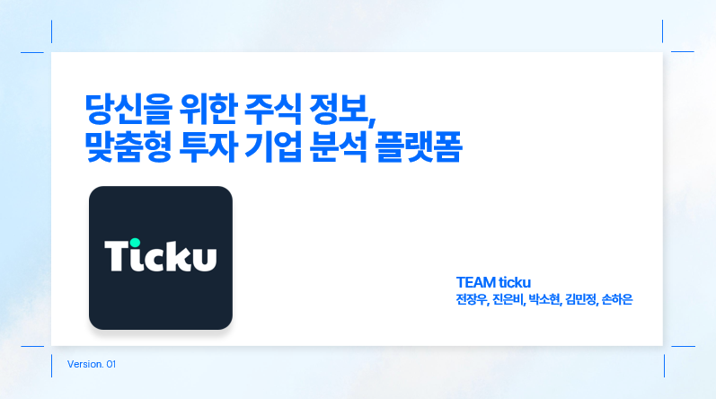

# 📖 주식 정보, 맞춤형 투자 기업 분석 플랫폼



## 시작하기

npm start

## 프로젝트 소개

- Ticku는 주식 초보자를 위한 국내 기업에 특화된 원스톱 정보 서비스입니다.
- 귀여운 캐릭터를 이용한 초보자 맞춤형 주식 기초 가이드를 제공하고 있습니다.
- 마이 페이지에서 관심 종목 및 뉴스 스크랩을 관리할 수 있습니다.
- 일상, 종목 추천, 포트폴리오 공유 등 친화적인 커뮤니티 기능을 사용할 수 있습니다.

## 팀원 구성

| 조장                                                      | 조원                                                       | 조원                                                                                         | 조원                                                                                        | 조원                                                       |
| --------------------------------------------------------- | ---------------------------------------------------------- | -------------------------------------------------------------------------------------------- | ------------------------------------------------------------------------------------------- | ---------------------------------------------------------- |
|  |  |  |  |  |
| 전장우                                                    | 박소현                                                     | 김민정                                                                                       | 손하은                                                                                      | 진은비                                                     |

---

## 개발 환경

Frontend : Html , React, Styledcomponents
Backend : Node.js , express , MongoDB
버전 및 이슈관리 : Github
협업 툴 : Notion
디자인 : Figma

## 주요 기능

- 시작 화면 페이지

  - 대표 캐릭터 티코가 앱 내부의 기능을 설명해준다.

- 회원가입, 로그인

  - 회원 가입 시 유저의 정보가 DB에 저장된다.
  - 아이디 중복 시 회원 가입이 되지 않는다.

- 로그인

  - 아이디, 비밀번호 입력 시 로그인

- 메인 페이지

  - 실시간 검색 상위 종목 1 ~ 10위 가 출력된다.
  - KOSPI, KOSDAQ 지수가 1주일 및 3개월 차트로 제공된다.
  - 차트 밑으로는 현재 지수가 제공된다.
  - 마이 페이지에서 지정한 대표 포트폴리오가 표시된다.

- 정보 제공 페이지

  - 검색 엔진에서 원하는 종목을 검색할 수 있다.
  - 검색한 종목의 차트, 기업 재무, 거래량, 뉴스, 배당, 실적 을 확인할 수 있다.

- 포트폴리오 페이지

  - 플러스 버튼 클릭 시 제작 페이지로 이동한다.
  - 포트폴리오 제목, 각 종목과 비율 입력 시 차트가 생성되고 save 버튼으로 localstorage에 저장하거나 reset 버튼으로 초기화할 수 있다.

- 티코 페이지
  - “티코”라는 캐릭터가 메인 화면에 나타나고 어려운 주식 개념들을 챗봇 형태로
    학습할 수 있다.
  - 학습 할 수 있는 개념들에는 주식 기초 지식, 차트 , 절세 계좌 등이 있다.
- 커뮤니티 페이지

  - 투자자들이 자유롭게 대화할 수 있는 소통 창구이다.
  - 마이페이지 내 닉네임 등록 시 닉네임으로 보여지고 미등록 시 익명으로
    표시된다. 익명/ 닉네임은 선택이 가능하다.
  - 글 작성 시 종목 추천 , 일상, 질문, 포트폴리오, 정보/분석 중 하나의 관심을
    선택할 수 있다.
    제목과 게시글을 입력하고 사진 첨부를 할 수 있다.

- 마이페이지
  - 프로필 사진 업데이트와 닉네임 변경이 가능하다.
  - 정보 제공 페이지에서 스크랩하였던 뉴스 목록과 지정된 관심 목록, 포트폴리오 페이지에서 제작하였던 포트폴리오를 확인할 수 있다.

## 프로젝트 구조

    project/
    ├── public/
    │   ├── images               # 이미지 파일
    │   └── favicon.ico          # 아이콘 파일
    ├── src/
    │   ├── assets/              # 이미지, 폰트 등 정적 파일
    │   ├── components/          # 재사용 가능한 UI 컴포넌트
     |   |   ├── common           # 공용 컴포넌트
     |   |   ├── communityPage    # 커뮤니티 페이지 컴포넌트
     |   |   ├── information      # 정보 제공 페이지 컴포넌트
     |   |   ├── mainpage         # 메인 페이지 컴포넌트
     |   |   ├── myPages          # 마이 페이지 컴포넌트
     |   |   ├── portfoliomakepage# 포트폴리오 제작 컴포넌트
     |   |   ├── portfoliopage    # 포트폴리오 컴포넌트
     |   |   ├── startPage        # 앱 시작 안내 페이지 컴포넌트
     |   |   ├── stockcalendarPage# 배당락일 캘린더 컴포넌트
     |   |   ├── tickoPages       # 용어 설명 페이지 컴포넌트
    │ ├── pages/               # 각 페이지
     |   |   ├── communityPages   # 커뮤니티 페이지
     |   |   ├── informationPages # 정보 제공 페이지
     |   |   ├── joinPage         # 회원가입 페이지
     |   |   ├── loginPage        # 로그인 페이지
     |   |   ├── mainpage         # 메인 페이지
     |   |   ├── myPages          # 마이 페이지
     |   |   ├── portfolioPages   # 포트폴리오 페이지
     |   |   ├── startPages       # 앱 시작 안내 페이지
     |   |   ├── stockcalendarPages # 배당락일 캘린더 페이지
     |   |   ├── tickoPages       # 용어 설명 페이지
    │ ├── routes/              # 페이지 라우팅
     |   |   ├── communityPages    # 커뮤니티 페이지 라우팅
     |   |   ├── joinPage          # 회원 가입 페이지 라우팅
     |   |   ├── loginPage         # 로그인 페이지 라우팅
     |   |   ├── myPages           # 마이 페이지 라우팅
     |   |   ├── portfolioPages    # 포트폴리오 페이지 라우팅
     |   |   ├── tickoPage          # 티코 페이지 라우팅
    │ ├── App.jsx                  # 메인 애플리케이션 컴포넌트
    │ ├── main.jsx                 # 엔트리 포인트 파일
    │ ├── index.css                # 전역 css 파일
    │   package-lock.json            # 정확한 종속성 버전이 기록된 파일로, 일관된 빌드를 보장
    │   package.json                   # 프로젝트 종속성 및 스크립트 정의
    ├── .gitignore                    # Git 무시 파일 목록
    └── README.md                # 프로젝트 개요 및 사용법

## Type 종류

```
feat : 새로운 기능 추가 (이미지추가 포함)
fix : 버그 수정
docs: 문서 수정
refactor : 코드 리팩토링
test : 테스트 코드 추가/수정
chore: 기타 변경 (빌드, 설정 등)
perf : 성능 개선
ci   : CI/CD 관련 변경
ui   : UI 작업
```
